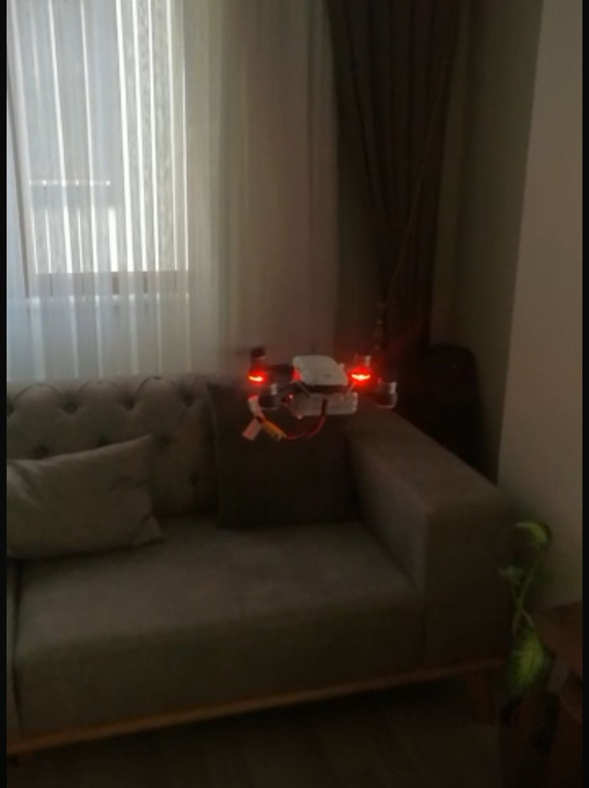
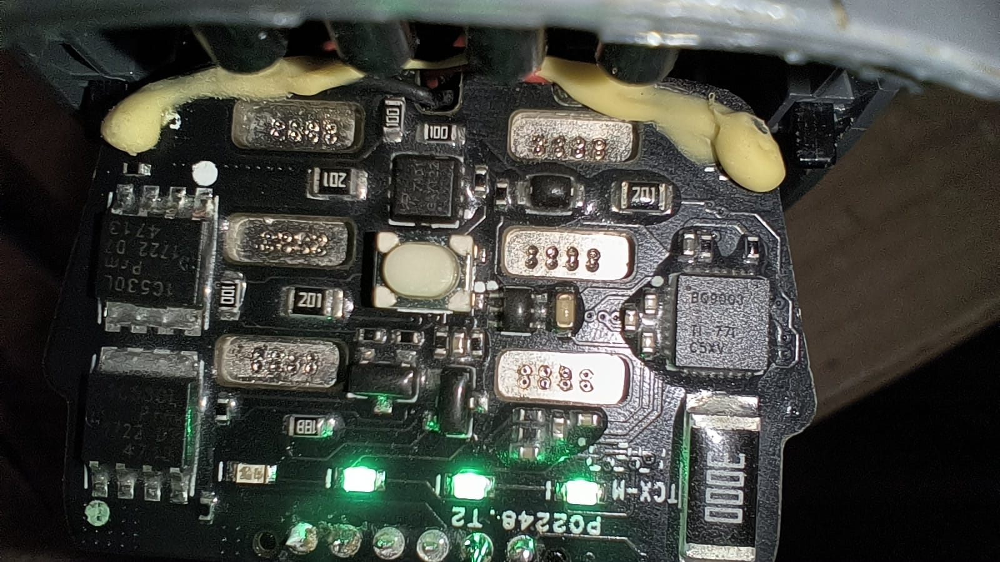
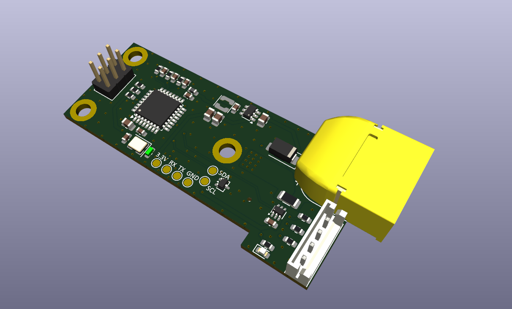
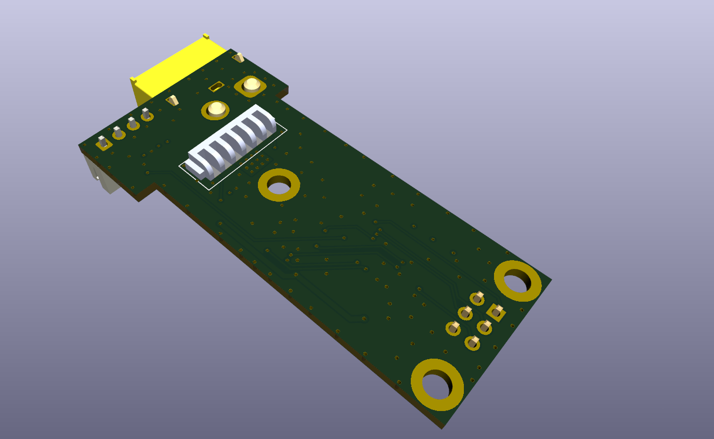
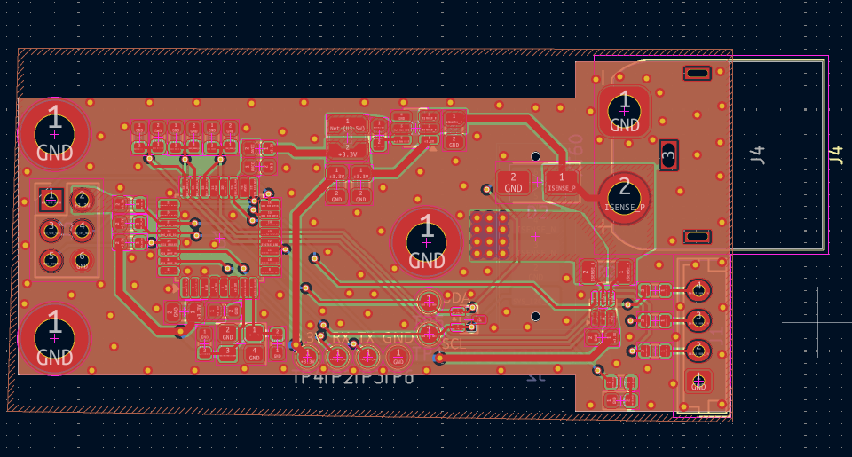

# SparkAltBatteryBoard

A custom research-oriented battery interface and telemetry board for the DJI Spark platform, built around a standard 3S LiPo battery pack instead of the discontinued, hard-to-find OEM Smart Battery.

This project documents a reverse-engineered I2C/SMBus smart-battery communication interface, originally developed to study how the DJI Spark flight controller communicates with its battery pack. The board sits between a standard 3S pack and the drone, reads the real cell voltages and current, and reproduces that communication interface.

<p align="center">
  
</p>

## How it works

1. The original DJI Spark Smart Battery was disassembled and its I2C/SMBus traffic with the flight controller was captured with a Saleae Logic Analyzer.
2. That traffic was decoded to recover the SBS + DJI-proprietary command set (auth handshake, cell voltages, PEC/CRC-8, etc.) — see [`Docs/I2C_BMS_PROTOCOL.md`](Docs/I2C_BMS_PROTOCOL.md).
3. A custom PCB replicates the OEM battery's form factor and connector, with resistor dividers for per-cell voltage sensing and an INA199 current shunt amplifier.
4. An ATmega328P on the board reproduces the Smart Battery communication interface over I2C in real time — computing PEC on the fly and clock-stretching where needed. See [`Firmware/README.md`](Firmware/README.md) for the full protocol implementation.

<p align="center">
  
</p>

## Repository structure

| Folder | Contents |
|---|---|
| [`Hardware/`](Hardware) | KiCad project: schematics, PCB layout, 3D connector models, Gerbers, BOM |
| [`Firmware/`](Firmware) | PlatformIO project for the ATmega328P I2C/SMBus battery emulator |
| [`Mechanical/`](Mechanical) | Battery mount 3D model (STEP) |
| [`Docs/`](Docs) | Schematic PDF, protocol reverse-engineering notes, raw sniffed I2C sessions, reference photos/video |

## Hardware

| Top | Bottom | Layout |
|---|---|---|
|  |  |  |

- **MCU:** ATmega328P — chosen specifically because its hardware TWI peripheral supports I2C clock stretching reliably, which the DJI FC's polling requires (see [`Firmware/README.md`](Firmware/README.md#hardware) for why an ESP32 doesn't work here).
- **Sensing:** 3-way resistor divider network for per-cell voltage taps, INA199 shunt amplifier for pack current.
- **Full schematic:** [`Docs/SparkAltBatteryBoardV1.pdf`](Docs/SparkAltBatteryBoardV1.pdf)
- **Fabrication outputs:** [BOM](Hardware/Fabrication/SparkAltBatteryBoard_BOM.csv) · [Gerbers](Hardware/Fabrication/SparkAltBatteryBoard_Gerbers.zip)
- **Battery mount:** [`Mechanical/batterymount.stp`](Mechanical/batterymount.stp)

### PCB Design / Manufacturing Notes

The PCB revision was prepared as a manufacturing-oriented KiCad project, not only as a proof-of-concept schematic.

Design considerations include:

- Hierarchical schematic structure
- Separated MCU, power, sensing, and connector blocks
- 3.3 V I2C/SMBus logic interface
- ADC-scaled cell-voltage sensing inputs
- RC filtering on analog measurement lines
- INA199 high-side current-sense frontend
- Kelvin-style shunt measurement routing approach
- Buck-regulated 3.3 V system rail
- I2C pull-up resistors
- ESD/TVS protection on external communication lines
- AVR ICSP programming/debug header
- Wide copper routing/polygon strategy for battery current path
- Manufacturing outputs prepared: BOM and Gerber package

## Firmware

PlatformIO project targeting the ATmega328P (Arduino Uno/Nano pinout). Handles the I2C slave logic, ADC reads, CRC-8 PEC calculation, and all SBS/DJI command responses.

```
pio run -e uno
pio run -e uno -t upload
```

Full pin map, supported command table, and known limitations: [`Firmware/README.md`](Firmware/README.md).

## Protocol reverse engineering

The raw logic analyzer captures used to decode the protocol are included for reference:

- [`Docs/sniffedsession2.csv`](Docs/sniffedsession2.csv)
- [`Docs/sniffedsession3.csv`](Docs/sniffedsession3.csv)
- Full write-up: [`Docs/I2C_BMS_PROTOCOL.md`](Docs/I2C_BMS_PROTOCOL.md)

## Legacy Prototype Flight Test

The video below shows an earlier prototype tested around 4 years ago. It does not represent a flight test of the redesigned PCB revision in this repository.

<video src="Docs/flyingvideo.mp4" controls width="100%" poster="Docs/flyingimage.jpeg">
  Your browser can't play the embedded video — <a href="Docs/flyingvideo.mp4">watch/download it here</a>.
</video>

## Disclaimer

This is a hobbyist reverse-engineering project, shared for educational purposes. Flying with a modified battery/BMS is at your own risk — verify cell voltages, current limits, and wiring yourself before flight. Not affiliated with or endorsed by DJI.

The original prototype was flight-tested in the past. The redesigned PCB revision in this repository has not yet been flight-tested because the original test drone was later damaged in a crash.

## License

Source-available for personal, educational, and research use. Commercial use is not permitted without written permission. See [`LICENSE`](LICENSE) (MIT with Commons Clause).
